# Kun Tang

  

<table align="center" width="80%" border="0">
  <tr>
    <td valign="top" align="left">
      <h3>currently</h3>
      
I am a Chemical Engineering PhD candidate at Dalian University of Technology, working at the intersection of quantum chemistry, reactive machine-learning potentials, and computer-aided molecular design. My current focus is building reproducible workflows that connect transition-state search and organometallic catalyst design with experimentally testable chemistry.

      <h3>writing</h3>
      
I write code and research notes about AI for Science, molecular modelling, scientific software, and the small details that make computational chemistry workflows reliable.

    </td>
    <td valign="top" align="right" width="36%">
      <em>“from electrons to experiments, one reproducible step at a time”</em> 
      — working principle  
      <a href="https://github.com/Senppoa">github.com/Senppoa</a> 
      <a href="mailto:tangkunmail@163.com">tangkunmail@163.com</a> 
      <a href="https://orcid.org/0009-0001-5735-9343">ORCID</a> ·
      <a href="https://scholar.google.com/citations?user=V6uW1gQAAAAJ">Scholar</a>
    </td>
  </tr>
</table>

## research / practice

- **Reactive MLIPs** — model development, data generation, evaluation, and scientific workflow integration.
- **Transition-state search** — automated TS initial guesses, optimization, IRC validation, and basin-aware screening.
- **Organometallic catalysis** — mechanism-aware descriptors, ligand screening, and structure–activity analysis.
- **Scientific engineering** — Python, PyTorch, ASE, PySCF, Gaussian, ORCA, RDKit, Linux, Slurm, and Git/GitHub.

## selected work

- [QMint](https://github.com/Senppoa/QMint) — quantum-chemistry interfaces for machine-learning interatomic potentials.
- [DeePEST-OS](https://github.com/kaipai-ren/DeePEST-OS) — reactive MLIP models, data, and transition-state search / IRC / training examples for organic reactions.
- [RMLP-for-OMCat](https://github.com/Senppoa/RMLP-for-OMCat) — reactive-MLIP workflows for organometallic-catalysis TS search and ligand screening.
- [Gauoptimizer-MLPs-interface](https://github.com/Senppoa/Gauoptimizer-MLPs-interface) — a Python interface for MLIP-driven Gaussian geometry optimization.
- [orb-hessian](https://github.com/Senppoa/orb-hessian) — analytical Hessians for ORB-family universal machine-learning potentials through second-order automatic differentiation.

## selected publications

- **Reactive machine learning potential for accelerating transition state search in organic synthesis** — *Nature Communications* (2026), co-first author. [DOI](https://doi.org/10.1038/s41467-026-72945-0)
- **Accelerating Transition State Search and Ligand Screening for Organometallic Catalysis with Reactive Machine Learning Potential** — *Journal of Chemical Theory and Computation* (2025), first author. [DOI](https://doi.org/10.1021/acs.jctc.5c01047)
- **GC-NORM-based thermodynamic framework for evaluations of organic reactions involving carbon dioxide utilization** — *Chemical Engineering Science* (2023), first author. [DOI](https://doi.org/10.1016/j.ces.2023.118913)

  PhD candidate · Dalian University of Technology · expected 2027

